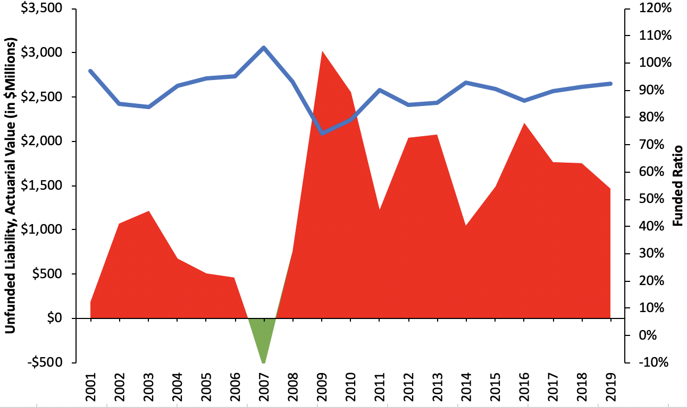
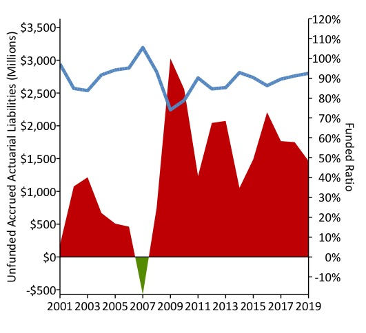

## R Reason Style Gide

##"Reason Theme/Graphics"
##author: "Anil Niraula"
##date: "6/30/2020"
##R Markdown

This is an R Markdown document that describes Reason graphics style in R.
Packages: `pensionviewr`, `reasonTheme` & `ggplot2`

##Defining
#Colors
#ggplot() themes, labels, and margins

# All images should use web safe colors — this gives us a range of orange and blue
# colors that fit with Reason’s branding, as well as reds and greens that we can use to
# indicate positive or negative data patterns. The following colors are most suitable:

palette_reason <- data.frame(
  Orange = "#FF6633", 
  DarkGrey = "#333333", 
  SpaceGrey = "#A69FA1",
  DarkBlue = "#1696d2",
  GreyBlue = "#6699CC", 
  Yellow = "#FFCC33", 
  LightBlue = "#3399CC", 
  SatBlue = "#3366CC", 
  Green = "#669900", 
  Red = "#CC0000")
  
##Convert color code to RedGreenBlue palette (with rgb())
#rgb1 <- col2rgb(colors$SatBlue, alpha = FALSE)/255
#rownames(rgb1) <- c("red", "green", "blue")
#ColorName <- rgb(rgb1[1],rgb1[2],rgb1[3])
#######
for (i in (1:8)){
x <- plot(c(5, 10), c(15, 30), type= "n", main=c(colnames(palette_reason[i])), xlab = "", 
ylab = c(as.character(palette_reason[1,i])), xaxt="n", yaxt="n",cex.lab=1.5, cex.main=2)
rect(5, 15, 10, 30, col = as.character(palette_reason[1,i]), border = "transparent")
}
## Standard Colors for graphics in R


## Standardized Font: "Calibri"
## Standardized graphics: ggpot() 
## Standardized Theme: reasonTheme (
      ##Main elements: line/rectangle/text
           line = ggplot2::element_line(
             rect = ggplot2::element_rect(
               text = ggplot2::element_text(
        
      ##Plot elements: title/subtitle/caption/background/margin
                 plot.title = ggplot2::element_text(
                    plot.subtitle = ggplot2::element_text(
                      plot.caption = ggplot2::element_text(
                        plot.background = 
                          plot.margin = 
                    ###Adjustable: text(size, angle,face(bold), margin)
                    
## What you have to specify in ggplo(): 
 ##Data to graph
 ##Y-axis & X-axis scales
 ##Title

## Original Mountain of Debt Plot using deptPlot() from `pensionviewr`
  

##Latest Mountain of Debt Plot using deptPlot()
## Modified colors & year labels
  

```{r, echo=FALSE}
```

Note that the `echo = FALSE` parameter was added to the code chunk to prevent printing of the R code that generated the plot.
